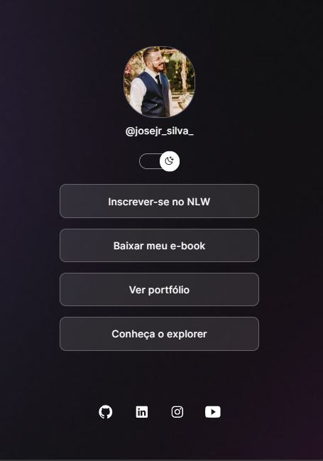
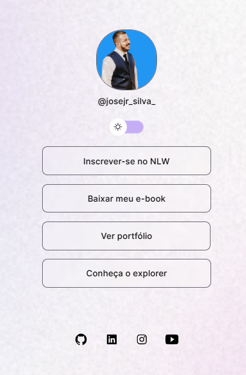

🚀# projeto- mini site perfil🚀

🚧 Em andamento 🚧 
💻 Projeto
Projeto desenvolvido para aprimorar meus conhecimentos em Html , Css e JS.

✅ Demonstração

Ao acessar a página , os usuarios são recebidos com o tema dark. Porém para uma melhor expericia do usuário os mesmos podem alterar para o tema light, com apenas um click.

⚙ Pré-requisitos
Antes de começar, você vai precisar ter instalado em sua máquina as seguintes ferramentas: Git, [Node.js]. Além disto é bom ter um editor para trabalhar com o código como VSCode

📗 Rodando a Aplicação (web)
# Clone este repositório

O site se inicia em tema dark , exibi de forma objetiva , suas funcionalidades e opções.
### 🚀 Tecnologias

Esse projeto foi desenvolvido com as seguintes tecnologias:
- Html
- CSS
- JavaScript

Feito por José Jr.

